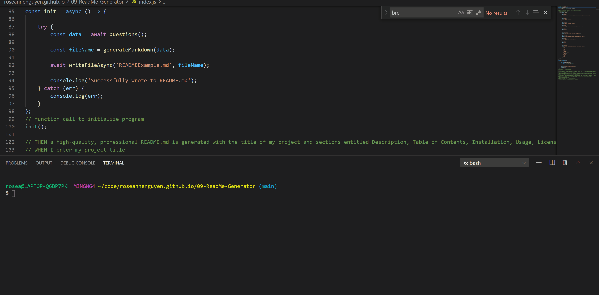

      

# Read Me Generator

  ## Table of Contents
  - [Description](#description)
  - [User Story](#userstory)
  - [Acceptance Criteria](#acceptancecriteria)
  - [Installation](#installation)
  - [Usage](#usage)
  - [License](#license)
  - [Contributing](#contributing)
  - [Tests](#tests)
  - [Questions](#questions)


  ## Description:
This is a ReadMe generator that can quickly create a professional ReadMe for projects uploaded to GitHub. The ReadMe example file generated and a video walk through of the application is located in the [utils directory.](https://github.com/roseannenguyen/09-ReadMe-Generator/tree/main/utils)




## User Story

```md
AS A developer
I WANT a README generator
SO THAT I can quickly create a professional README for a new project
```

## Acceptance Criteria

```md
GIVEN a command-line application that accepts user input
WHEN I am prompted for information about my application repository
THEN a high-quality, professional README.md is generated with the title of my project and sections entitled Description, Table of Contents, Installation, Usage, License, Contributing, Tests, and Questions
WHEN I enter my project title
THEN this is displayed as the title of the README
WHEN I enter a description, installation instructions, usage information, contribution guidelines, and test instructions
THEN this information is added to the sections of the README entitled Description, Installation, Usage, Contributing, and Tests
WHEN I choose a license for my application from a list of options
THEN a badge for that license is added near the top of the README and a notice is added to the section of the README entitled License that explains which license the application is covered under
WHEN I enter my GitHub username
THEN this is added to the section of the README entitled Questions, with a link to my GitHub profile
WHEN I enter my email address
THEN this is added to the section of the README entitled Questions, with instructions on how to reach me with additional questions
WHEN I click on the links in the Table of Contents
THEN I am taken to the corresponding section of the README
```
 
  ## Installation:
```text
npm init 
[Inquirer package](https://www.npmjs.com/package/inquirer)
```

  ## Usage:
 This was used for learning purposes for the University of Arizona's Coding Boot Camp course. 

  ## License(s) Used:
  -  
  - Shields.io for the badges.   

  ## Contributing:
| Name | Github Profile|
| ------------- | ------------- |
| Roseanne nguyen  | [roseannenguyen](https://github.com/roseannenguyen)|


  ## Test:
No tests were installed for this project.
  
  ## Questions:
 If you have any questions about the project, please feel free to email: roseannenguyen@protonmail.com

  We can also connect on Github at: [roseannenguyen](https://github.com/roseannenguyen).